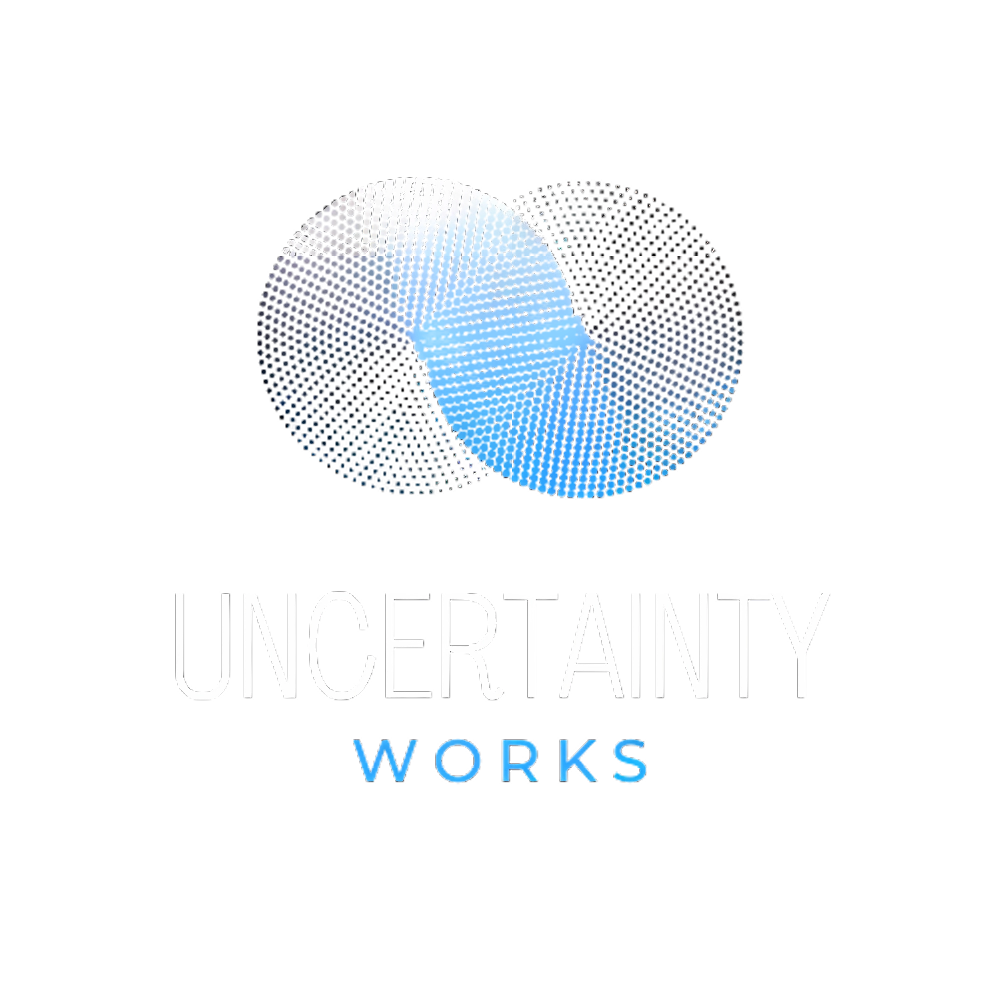

# 🔮 Uncertainty Works

Welcome to **Uncertainty Works** — an open-source initiative crafting elegant tools at the bleeding edge of **quantum computing**, **mathematics**, and **chaotic systems**.

> ✨ *We explore uncertainty not as a flaw in systems, but as the very essence of intelligence.*

---

## 🌐 Live Demo

> 🔗 [Check out the landing page](https://your-deployed-url.com)  
Built using **TailwindCSS**, **Lottie animations**, and a futuristic glassmorphic design.

---

## 💡 Vision

We embrace uncertainty. From **quantum indeterminacy** to **chaotic attractors**, our goal is to make high-dimensional, complex math *accessible*, *interactive*, and *beautiful* through open-source tools and visual simulations.

---

## 🛠️ Built With

- `HTML5 + TailwindCSS` — blazing fast and responsive UI
- `Lottie Animations` — dynamic SVG-based animations
- `Glassmorphism UI` — for a high-end futuristic aesthetic
- `Responsive Layout` — mobile-first design principles

---

## 🚀 Upcoming Featured Projects

| Project       | Description |
|---------------|-------------|
| 🔬 **QuantumJupyter** | A Streamlit-powered visual playground for QML. Drag, drop, simulate quantum circuits. |
| 🌀 **ChaosPy**        | Python toolkit to visualize and explore fractals, Lorenz systems, and chaotic attractors. |
| 🔺 **TopoPy**         | A topological data analysis suite — simplicial complexes, persistent homology & more. |

---

## 🌱 Roadmap Highlights

- QuantumJupyter v1.0 → Variational circuit modules
- ChaosPy → Mandelbrot + Lorenz interactive playgrounds
- TopoPy → Persistent homology graphing tools
- Open course series on quantum & chaos
- Hacktoberfest 2025 community onboarding & live sessions

---

## 🧑‍💻 Community & Contribution

We're building a collaborative, curious, and chaotic community.

- ✨ [Contribute on GitHub](https://github.com/UncertaintyWorks)
- 📚 Improve docs, raise issues, submit pull requests
- 🌍 Join our Discord (coming soon!)

---

## 👥 Founders

| Name            | Role                      |
|-----------------|---------------------------|
| **Anurag Sharma** | Co-Founder & Research Lead |
| **Nityansh Pant** | Co-Founder & Technical Lead |

---

## 📄 License

This project is open-source and available under the **MIT License**.

---

> Made with curiosity for math, code, and chaos — by the Uncertainty Works collective.
